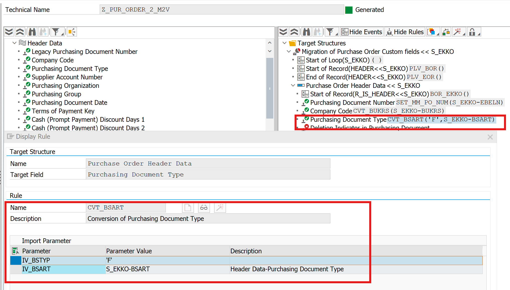
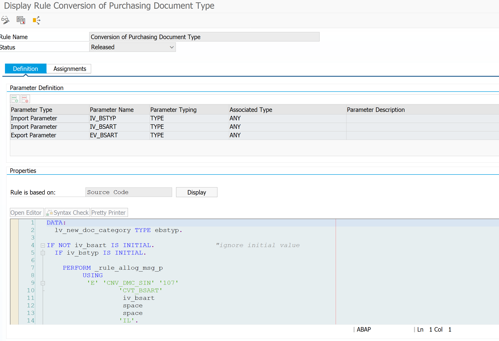
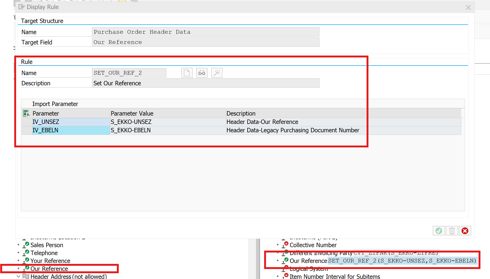
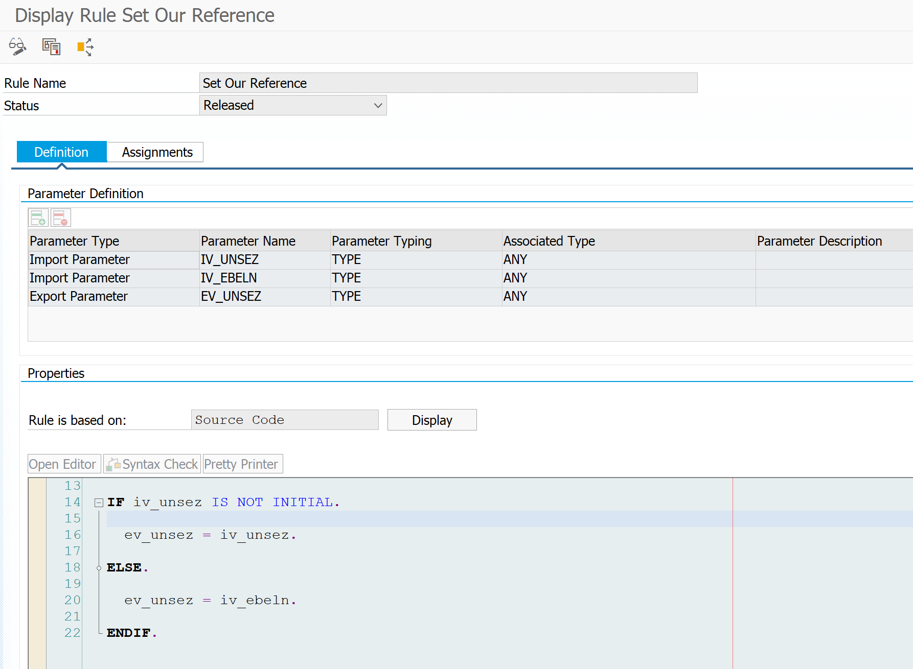

 
Hi team,
Below are the details regarding the conversions currently maintained in the field mappings for different migration objects.
These are common conversion rules available across migration objects; however, there may also be migration-object-specific conversions depending on the object and its mapping requirements.
The conversions are written as ABAP code rules in the field mapping logic. We need to understand and document:
When these conversion rules are executed during the Migration Cockpit data load process
How these conversions are triggered
At which stage of the migration flow the converted values are applied
Whether the execution behavior differs by migration object
Any dependencies or prerequisites for these conversions to work correctly
Can we automate these executions as part of Pre Validation API. 
Migration consultants would be the right reference group to help clarify this behavior. We can connect with the consultants we have already reached out to earlier, or with any other known contacts who have experience with Migration Cockpit data loads and field mapping conversions.
Example Conversion:
For one of the field mappings, the Purchasing Document Type is determined based on the input value of BSTYP — Purchasing Document Category.
In this case, the ABAP conversion logic reads the input value for BSTYP and derives the appropriate Purchasing Document Type according to the rules written in the conversion.

Conversion example 2:

In this case, the ABAP conversion logic reads the input value for Our reference and sets the value for same field according to the rules written in the conversion.