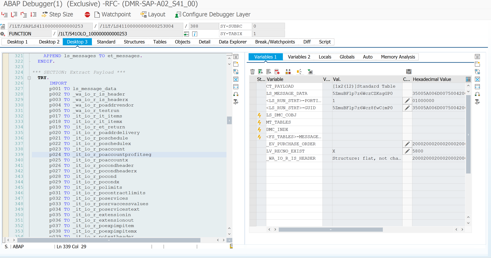
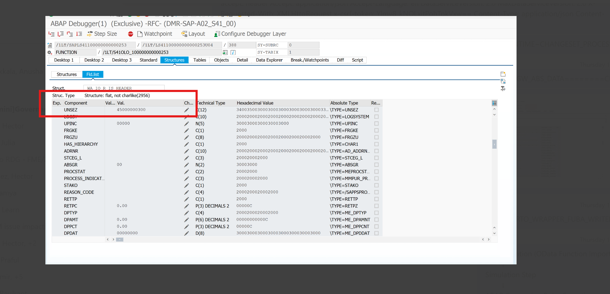

Analyze ABAP Field Mapping Conversion Execution in Migration Cockpit

Field mappings for migration objects contain multiple conversion rules written in ABAP. Some of these conversions are common across migration objects, while others may be specific to individual migration objects.

Currently, there is a gap in understanding around:

When these ABAP conversion rules are executed during the Migration Cockpit data load process

How the conversions are triggered

Whether conversions are executed during simulation, validation, staging, mapping, or final load

How converted values are passed to the target structure

Whether the execution behavior differs by migration object

How consultants configure or expect these conversion rules to behave

Example:
For a purchasing-related migration object, the Purchasing Document Type is determined based on the input value of BSTYP — Purchasing Document Category. The ABAP conversion logic derives the appropriate document type from the provided category.

This behavior needs to be analyzed and documented with inputs from migration consultants.

Acceptance Criteria
ABAP conversion rules in field mappings are reviewed.

Execution timing of the conversion logic is identified and documented.

Trigger mechanism for conversion logic is understood and documented.

Migration consultant/SME input is captured.

Common and object-specific conversions are differentiated.

Findings are documented and shared with the team.

Any open questions or gaps are clearly listed for follow-up.

Task -

Based on the inputs provided, to check if we can automate these executions as part of Pre Validation API. 

Atividade:

These are the few points i collected on this based on the bandwidth i had.

Based on the information i got from the copilot and migration consultant, abap conversion rules execute at the simulation step.

Before simulation step, mapping is very important step that carry forward data to the simulation step. (same this is conveyed by migration consultant)

From my debugging i found out there will be a dynamic Function module created for every migration object that has all the BAPI executions. But the input to this FM is being passed as converted values.

For example: This is the FM /1S4/* as mentioned in the image is the dynamic function module.

here when i see the data the input given to the FM it is already converted value of our reference field.

My assumption is this data is getting carryforward from the mapping step.