# Guia de Implementação — RAP Dynamic BAPI Runner

Passo a passo para publicar o serviço **RAP/OData V4** em um sistema
**SAP S/4HANA on-premise** (SAP_BASIS 7.55+) ou **ABAP Environment**.

---

## Sumário

1. [Pré-requisitos](#1-pré-requisitos)
2. [Ordem de criação dos objetos](#2-ordem-de-criação-dos-objetos)
3. [Passo 1 — Pacote e transporte](#3-passo-1--pacote-e-transporte)
4. [Passo 2 — Tabela de persistência](#4-passo-2--tabela-de-persistência)
5. [Passo 3 — Abstract entities (input/output da action)](#5-passo-3--abstract-entities-inputoutput-da-action)
6. [Passo 4 — CDS Root + Projection](#6-passo-4--cds-root--projection)
7. [Passo 5 — Behavior Definitions](#7-passo-5--behavior-definitions)
8. [Passo 6 — Behavior Pool + Handler local](#8-passo-6--behavior-pool--handler-local)
9. [Passo 7 — Classes de despacho / caller / worker](#9-passo-7--classes-de-despacho--caller--worker)
10. [Passo 8 — Service Definition + Service Binding](#10-passo-8--service-definition--service-binding)
11. [Passo 9 — Server Group RFC (RZ12)](#11-passo-9--server-group-rfc-rz12)
12. [Passo 10 — Autorizações](#12-passo-10--autorizações)
13. [Passo 11 — Testes (ATC, ADT Preview, Postman)](#13-passo-11--testes-atc-adt-preview-postman)
14. [Anexo A — Payload OData completo](#14-anexo-a--payload-odata-completo)
15. [Anexo B — Troubleshooting](#15-anexo-b--troubleshooting)

---

## 1. Pré-requisitos

| Item | Requisito |
|---|---|
| Release | SAP_BASIS 7.55+ (RAP managed) ou ABAP Environment |
| ADT | Eclipse com ABAP Development Tools |
| JSON lib | `/UI2/CL_JSON` (fallback: `xco_cp_json` no Steampunk) |
| BAPI alvo | Existente e RFC-enabled (ex.: `BAPI_PO_CREATE1`) |
| Server group | Grupo RFC configurado em `RZ12` (recomendado) |
| Autorizações | `S_DEVELOP`, `S_RFC`, `S_SERVICE`, `S_TCODE` (STC01, SICF, SM59, RZ12) |

## 2. Ordem de criação dos objetos

```mermaid
flowchart LR
    A[Pacote ZBAPI_RAP] --> B[Tabela ZBAPI_RUN]
    B --> C[Abstract entities ZD_BAPI_SUBMIT_IN/OUT]
    C --> D[CDS ZR_BAPI_RUN + ZC_BAPI_RUN]
    D --> E[Behavior Definitions]
    E --> F[Behavior Pool + locals_imp]
    F --> G[Classes: dispatcher + caller]
    G --> H[Function Group + FM Z_BAPI_RAP_WORKER]
    H --> I[Service Definition + Binding]
    I --> J[Preview / STC01 / Ativação Binding]
```



Cada objeto depende dos anteriores. Ativar de baixo para cima evita
erros de sintaxe transitórios.

---

## 3. Passo 1 — Pacote e transporte

1. `SE80` → **Create → Package** → `ZBAPI_RAP`
   - Software Component: `HOME` (ou customer namespace)
   - Application component: `CA-GTF`
2. Criar Transport Request para agrupar todos os objetos.

Para dev local rápido: usar `$TMP`.

---

## 4. Passo 2 — Tabela de persistência

`SE11` → Database Table → `ZBAPI_RUN`.

Campos (ver [`zbapi_run.tabl.xml`](./zbapi_run.tabl.xml)):

- `CLIENT` (key) — `MANDT`
- `RUN_UUID` (key) — `RAW(16)` (`SYSUUID_X16`)
- `BAPI_NAME` — `CHAR(30)`
- `EXEC_MODE` — `CHAR(10)`   *(campo `MODE` renomeado - palavra reservada em DDIC)*
- `WORKER_THREADS`, `WORKER_ROWS`, `ACCEPTED`, `WORKERS` — `INT4`
- `STATUS` — `CHAR(10)`
- `ERROR_TEXT` — `CHAR(220)`
- `CREATED_BY`, `CREATED_AT`, `LAST_CHANGED_BY`, `LAST_CHANGED_AT`, `LOCAL_LAST_CHANGED_AT`

Delivery class `A`, Data Browser Maint. `X`, MC Category `APPL0`.
**Enhancement Category**: *Can Be Enhanced (Deep)*.
Ativar.

---

## 5. Passo 3 — Abstract entities (input/output da action)

Criar via ADT → New Data Definition:

- `ZD_BAPI_SUBMIT_IN` — [`zd_bapi_submit_in.ddls.asddls`](./zd_bapi_submit_in.ddls.asddls)
- `ZD_BAPI_SUBMIT_OUT` — [`zd_bapi_submit_out.ddls.asddls`](./zd_bapi_submit_out.ddls.asddls)

Ativar ambas.

> Detalhe importante: **abstract entities** são o mecanismo RAP para
> tipar parâmetros e resultados de actions em OData V4. Não geram tabela
> nem view — funcionam como *complex types* do OData.

---

## 6. Passo 4 — CDS Root + Projection

1. ADT → New Data Definition → `ZR_BAPI_RUN`
   Colar [`zr_bapi_run.ddls.asddls`](./zr_bapi_run.ddls.asddls) → ativar.
2. New Data Definition → `ZC_BAPI_RUN`
   Colar [`zc_bapi_run.ddls.asddls`](./zc_bapi_run.ddls.asddls) → ativar.
3. New Metadata Extension → `ZC_BAPI_RUN`
   Colar [`zc_bapi_run.mde.asmde`](./zc_bapi_run.mde.asmde) → ativar.

---

## 7. Passo 5 — Behavior Definitions

1. Na `ZR_BAPI_RUN` → botão direito → **New Behavior Definition**.
   Colar [`zr_bapi_run.bdef.asbdef`](./zr_bapi_run.bdef.asbdef).
2. Na `ZC_BAPI_RUN` → botão direito → **New Behavior Definition** (Projection).
   Colar [`zc_bapi_run.bdef.asbdef`](./zc_bapi_run.bdef.asbdef).

Ativar ambas. A raiz vai reclamar que a classe `zbp_r_bapi_run` ainda
não existe — **normal**, será criada no próximo passo.

---

## 8. Passo 6 — Behavior Pool + Handler local

1. ADT → New ABAP Class → `zbp_r_bapi_run`.
   Colar [`zbp_r_bapi_run.clas.abap`](./zbp_r_bapi_run.clas.abap).
2. No editor da classe → aba **Local Types** → colar
   [`zbp_r_bapi_run.clas.locals_imp.abap`](./zbp_r_bapi_run.clas.locals_imp.abap).

Ainda **não ativar** — depende do dispatcher (próximo passo).

---

## 9. Passo 7 — Classes de despacho / caller / worker

Ordem obrigatória:

1. ADT → New ABAP Class → `zcl_bapi_rap_dispatcher`.
   Colar [`zcl_bapi_rap_dispatcher.clas.abap`](./zcl_bapi_rap_dispatcher.clas.abap).
   Aba **Test Classes** → colar
   [`zcl_bapi_rap_dispatcher.clas.testclasses.abap`](./zcl_bapi_rap_dispatcher.clas.testclasses.abap).
   Ativar.
2. ADT → New ABAP Class → `zcl_bapi_rap_caller`.
   Colar [`zcl_bapi_rap_caller.clas.abap`](./zcl_bapi_rap_caller.clas.abap).
   Ativar.
3. `SE80` → botão direito no pacote → **Create → Function Group** →
   `Z_BAPI_RAP_WORKER`.
4. `SE37` → **Create** → `Z_BAPI_RAP_WORKER` no grupo homônimo.
   - Aba **Attributes** → marcar **Remote-Enabled Module**.
   - Aba **Import**:
     | Parameter | Type | Pass Value | Optional | Default |
     |---|---|---|---|---|
     | `IV_BAPI_NAME` | `STRING` | ✓ | | |
     | `IV_MODE` | `STRING` | ✓ | ✓ | `'async'` |
     | `IV_CHUNK` | `STRING` | ✓ | | |
   - Aba **Source Code**: colar o corpo de
     [`z_bapi_rap_worker.fugr.abap`](./z_bapi_rap_worker.fugr.abap)
     entre `FUNCTION`/`ENDFUNCTION`.
   - Ativar.
5. Voltar à classe `zbp_r_bapi_run` → ativar (`Ctrl+F3`).

---

## 10. Passo 8 — Service Definition + Service Binding

1. Na `ZC_BAPI_RUN` → botão direito → **New Service Definition** →
   `ZUI_BAPI_RUN_O4`. Colar
   [`zui_bapi_run_o4.srvd.asrvd`](./zui_bapi_run_o4.srvd.asrvd). Ativar.
2. Sobre a Service Definition → botão direito → **New Service Binding** →
   `ZUI_BAPI_RUN_O4`, **binding type** = `OData V4 - Web API`.
   Ver [`zui_bapi_run_o4.srvb.srvb`](./zui_bapi_run_o4.srvb.srvb) como
   referência. Ativar.
3. **Ativar/Publicar o binding** no editor: botão *Activate* na tela do
   Service Binding.

### 10.1 On-premise: registrar via STC01

Em S/4HANA on-premise use a **task list `SAP_GATEWAY_ADD_SYSTEM_ALIAS`**
ou **`SAP_GATEWAY_ACTIVATE_ODATA_SERV`** para expor o binding:

`STC01` → task list `SAP_GATEWAY_ACTIVATE_ODATA_SERV`
→ preencher `Technical Name` = `ZUI_BAPI_RUN_O4`.

URL final típica:

```
/sap/opu/odata4/sap/zui_bapi_run_o4/srvd_a2x/sap/zui_bapi_run_o4/0001/
```

### 10.2 ABAP Environment (Steampunk)

Basta ativar o binding — a URL é gerada automaticamente e o registro na
Cloud Communication Management aparece no BSP `/UI2/FLP` ou pelo Fiori
Launchpad space *Custom Business Services*.

---

## 11. Passo 9 — Server Group RFC (RZ12)

Para paralelismo efetivo em `STARTING NEW TASK DESTINATION IN GROUP DEFAULT`:

1. `RZ12` → grupo `DEFAULT` (ou criar `PARALLEL_GEN` dedicado).
2. Configurar quota mínima de work processes RFC.
3. Se usar grupo dedicado, ajustar a constante do dispatcher
   ou o `DESTINATION IN GROUP` no worker call.

Recomendação: nunca ultrapasse `metric M_BTC / 2` de threads simultâneas.

---

## 12. Passo 10 — Autorizações

Objeto RAP `S_SERVICE`:

| Field | Value |
|---|---|
| `SRV_NAME` | `ZUI_BAPI_RUN_O4` |
| `SRV_TYPE` | `HT` |
| `SRV_CHECK` | `X` |

Adicionalmente:

- `S_RFC` para a FM `Z_BAPI_RAP_WORKER` (RFC dispatch).
- Autorizações específicas da BAPI alvo (ex.: `M_BEST_EKO` para PO).

---

## 13. Passo 11 — Testes (ATC, ADT Preview, Postman)

### 13.1 Unit tests

`Ctrl+Shift+F10` na classe `zcl_bapi_rap_dispatcher` — os 6 testes
locais em [`zcl_bapi_rap_dispatcher.clas.testclasses.abap`](./zcl_bapi_rap_dispatcher.clas.testclasses.abap)
devem passar.

### 13.2 Service Binding preview

Botão *Preview* no editor do Service Binding → abre o Fiori Launchpad
com a entidade `BapiRun` navegável (List Report + Object Page).

### 13.3 Postman / curl smoke test

Fetch CSRF token:

```http
HEAD /sap/opu/odata4/sap/zui_bapi_run_o4/srvd_a2x/sap/zui_bapi_run_o4/0001/
X-CSRF-Token: Fetch
```

Chamar a action:

```http
POST /sap/opu/odata4/sap/zui_bapi_run_o4/srvd_a2x/sap/zui_bapi_run_o4/0001/BapiRun/com.sap.gateway.srvd_a2x.zui_bapi_run_o4.v0001.Submit
X-CSRF-Token: <token>
Content-Type: application/json

{ "Payload": "{\"bapi_name\":\"BAPI_PO_CREATE1\",\"worker_threads\":4,\"worker_rows\":5000,\"heders_values\":[...],\"items_values\":[...]}" }
```

Resposta esperada `202 Accepted` com o payload:

```json
{
  "@odata.context": ".../$metadata#Collection(...)",
  "value": [
    { "RunUuid": "…", "BapiName": "BAPI_PO_CREATE1",
      "Accepted": 1, "Workers": 1, "ExecMode": "async" }
  ]
}
```

Confirme a linha em `SE16 → ZBAPI_RUN` ou via
`GET BapiRun('<RunUuid>')`.

---

## 14. Anexo A — Payload OData completo

Ver [`input.json`](./input.json) — arquivo com o envelope OData
(`{ "Payload": { ... } }`). Antes de enviar via Postman, serializar o
objeto de `Payload` como **string escapada**.

Truque em `jq`:

```bash
cat input.json | jq -c '.Payload | tostring' | jq '{ Payload: . }'
```

## 15. Anexo B — Troubleshooting

| Sintoma | Causa provável | Ação |
|---|---|---|
| `Action Submit not found` na URL | Binding não republicado após alterar bdef | Ativar Service Binding novamente |
| `Payload is empty` na resposta | Client mandou objeto em vez de string | Enviar `Payload` como **string escapada** |
| `bapi_name is mandatory` | JSON interno vazio | Validar payload antes de chamar |
| `RESOURCE_FAILURE` no worker | FM não é Remote-Enabled | Marcar aba Attributes do FM |
| `NO_FREE_WP` em `SM66` | Server group RFC sem quota | Ajustar `RZ12` grupo `DEFAULT` |
| BAPI executa mas nada persiste | RETURN traz mensagem `E` — rollback correto | Ler `zbapi_run` + log da BAPI |
| `403` no OData action | `S_SERVICE` faltando ou objeto da BAPI ausente | Ajustar perfil |

---

## English Version

# Implementation Guide — RAP Dynamic BAPI Runner

Step-by-step instructions to publish the RAP/OData V4 service on SAP S/4HANA
on-premise (SAP_BASIS 7.55+) or ABAP Environment.

## 1. Prerequisites

- SAP_BASIS 7.55+ (managed RAP) or ABAP Environment
- ADT (Eclipse)
- `/UI2/CL_JSON` available
- Existing RFC-enabled BAPI/FM
- RFC server group configured in `RZ12`
- Authorizations: `S_DEVELOP`, `S_RFC`, `S_SERVICE`, `S_TCODE`

## 2. Object creation order

1. Package `ZBAPI_RAP`
2. Table `ZBAPI_RUN`
3. Abstract entities `ZD_BAPI_SUBMIT_IN` and `ZD_BAPI_SUBMIT_OUT`
4. CDS views `ZR_BAPI_RUN` and `ZC_BAPI_RUN`
5. Behavior definitions
6. Behavior pool and local handler implementation
7. Dispatcher/caller classes and worker FM
8. Service definition and service binding

Activate objects in dependency order to avoid transient syntax errors.

## 3. Package and transport

- Create package `ZBAPI_RAP` in `SE80`
- Create transport request for all objects
- Use `$TMP` only for local/non-transportable work

## 4. Persistence table

Create table `ZBAPI_RUN` in `SE11`.

Key fields:
- `CLIENT`
- `RUN_UUID`

Main business fields:
- `BAPI_NAME`
- `EXEC_MODE` (renamed from `MODE` due to reserved word)
- `WORKER_THREADS`, `WORKER_ROWS`, `ACCEPTED`, `WORKERS`
- `STATUS`, `ERROR_TEXT`

Administrative fields:
- `CREATED_BY`, `CREATED_AT`, `LAST_CHANGED_BY`, `LAST_CHANGED_AT`, `LOCAL_LAST_CHANGED_AT`

## 5. Abstract entities

Create and activate:
- `ZD_BAPI_SUBMIT_IN`
- `ZD_BAPI_SUBMIT_OUT`

These entities define typed action input/output for OData V4.

## 6. CDS root and projection

Create and activate:
- `ZR_BAPI_RUN`
- `ZC_BAPI_RUN`
- metadata extension `ZC_BAPI_RUN`

## 7. Behavior definitions

Create and activate:
- `ZR_BAPI_RUN` behavior definition
- `ZC_BAPI_RUN` behavior projection

## 8. Behavior pool and local handler

Create class `ZBP_R_BAPI_RUN` and local implementation include.
The local handler implements static action `Submit`.

## 9. Dispatcher, caller, and worker FM

Create and activate in this order:

1. `ZCL_BAPI_RAP_DISPATCHER`
2. `ZCL_BAPI_RAP_CALLER`
3. Function group and FM `Z_BAPI_RAP_WORKER` (Remote-Enabled)

FM import parameters:
- `IV_BAPI_NAME` (`STRING`)
- `IV_MODE` (`STRING`, default `'async'`)
- `IV_CHUNK` (`STRING`)

## 10. Service definition and binding

Create:
- Service definition `ZUI_BAPI_RUN_O4`
- Service binding `ZUI_BAPI_RUN_O4` as OData V4 Web API

Activate/publish binding and validate final URL:

```
/sap/opu/odata4/sap/zui_bapi_run_o4/srvd_a2x/sap/zui_bapi_run_o4/0001/
```

## 11. RFC server group

In `RZ12`, configure `DEFAULT` (or a dedicated group) with enough RFC work
process capacity for expected parallelism.

## 12. Authorizations

Grant `S_SERVICE` for `ZUI_BAPI_RUN_O4`, plus `S_RFC` for worker FM and
business authorizations required by target BAPIs.

## 13. Testing

1. Run ABAP Unit tests for `zcl_bapi_rap_dispatcher`
2. Preview service binding
3. Fetch CSRF token
4. Call static action `Submit` with escaped JSON payload
5. Validate response and persisted row in `ZBAPI_RUN`

## 14. OData payload note

`Payload` must be sent as an escaped JSON string.

Example conversion:

```bash
cat input.json | jq -c '.Payload | tostring' | jq '{ Payload: . }'
```

## 15. Troubleshooting

- `Action Submit not found`: reactivate service binding after behavior changes.
- `Payload is empty`: client sent object instead of escaped JSON string.
- `RESOURCE_FAILURE`: worker FM not flagged as Remote-Enabled.
- `NO_FREE_WP`: increase RFC worker capacity in `RZ12`.
- `403`: missing `S_SERVICE` or missing business authorization for the called BAPI.
