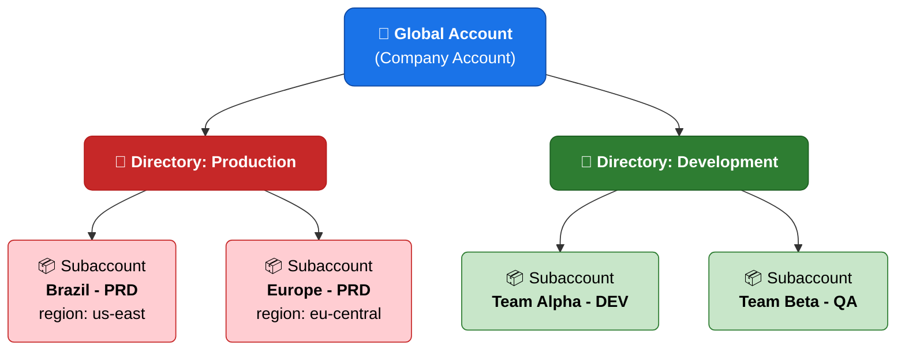

# SAP BTP — Organizational Structure

```mermaid
graph TD
    GA["🏢 <b>Global Account</b><br/>(Company Account)"]

    GA --> DIR_PRD["📁 <b>Directory: Production</b>"]
    GA --> DIR_DEV["📁 <b>Directory: Development</b>"]

    DIR_PRD --> SUB_BR["📦 Subaccount<br/><b>Brazil - PRD</b><br/>region: us-east"]
    DIR_PRD --> SUB_EU["📦 Subaccount<br/><b>Europe - PRD</b><br/>region: eu-central"]

    DIR_DEV --> SUB_ALPHA["📦 Subaccount<br/><b>Team Alpha - DEV</b>"]
    DIR_DEV --> SUB_BETA["📦 Subaccount<br/><b>Team Beta - QA</b>"]

    style GA fill:#1a73e8,stroke:#0d47a1,color:#fff,rx:10
    style DIR_PRD fill:#c62828,stroke:#b71c1c,color:#fff,rx:8
    style DIR_DEV fill:#2e7d32,stroke:#1b5e20,color:#fff,rx:8
    style SUB_BR fill:#ffcdd2,stroke:#c62828,color:#000,rx:6
    style SUB_EU fill:#ffcdd2,stroke:#c62828,color:#000,rx:6
    style SUB_ALPHA fill:#c8e6c9,stroke:#2e7d32,color:#000,rx:6
    style SUB_BETA fill:#c8e6c9,stroke:#2e7d32,color:#000,rx:6
```