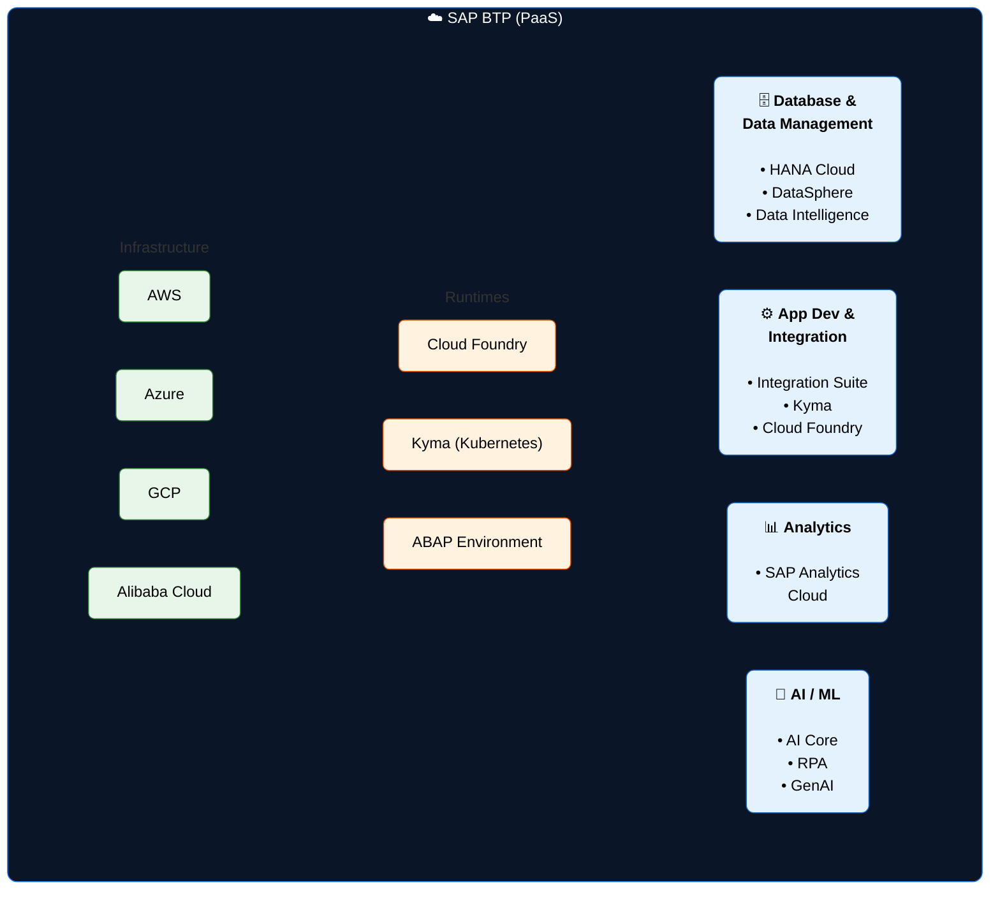

# SAP BTP — Pillars

```mermaid
graph TB
    subgraph BTP["☁️ SAP BTP (PaaS)"]
        direction TB

        subgraph Pillars[" "]
            direction LR
            DB["🗄️ <b>Database &<br/>Data Management</b><br/><br/>• HANA Cloud<br/>• DataSphere<br/>• Data Intelligence"]
            APP["⚙️ <b>App Dev &<br/>Integration</b><br/><br/>• Integration Suite<br/>• Kyma<br/>• Cloud Foundry"]
            AN["📊 <b>Analytics</b><br/><br/>• SAP Analytics<br/>  Cloud"]
            AI["🤖 <b>AI / ML</b><br/><br/>• AI Core<br/>• RPA<br/>• GenAI"]
        end

        subgraph Runtime["Runtimes"]
            direction LR
            CF["Cloud Foundry"]
            KY["Kyma (Kubernetes)"]
            AB["ABAP Environment"]
        end

        subgraph Infra["Infrastructure"]
            direction LR
            AWS["AWS"]
            AZ["Azure"]
            GCP["GCP"]
            ALI["Alibaba Cloud"]
        end
    end

    style BTP fill:#0a1628,stroke:#1a73e8,color:#fff,rx:10
    style Pillars fill:none,stroke:none
    style Runtime fill:none,stroke:none
    style Infra fill:none,stroke:none
    style DB fill:#e3f2fd,stroke:#1565c0,color:#000,rx:8
    style APP fill:#e3f2fd,stroke:#1565c0,color:#000,rx:8
    style AN fill:#e3f2fd,stroke:#1565c0,color:#000,rx:8
    style AI fill:#e3f2fd,stroke:#1565c0,color:#000,rx:8
    style CF fill:#fff3e0,stroke:#e65100,color:#000,rx:6
    style KY fill:#fff3e0,stroke:#e65100,color:#000,rx:6
    style AB fill:#fff3e0,stroke:#e65100,color:#000,rx:6
    style AWS fill:#e8f5e9,stroke:#2e7d32,color:#000,rx:6
    style AZ fill:#e8f5e9,stroke:#2e7d32,color:#000,rx:6
    style GCP fill:#e8f5e9,stroke:#2e7d32,color:#000,rx:6
    style ALI fill:#e8f5e9,stroke:#2e7d32,color:#000,rx:6
```