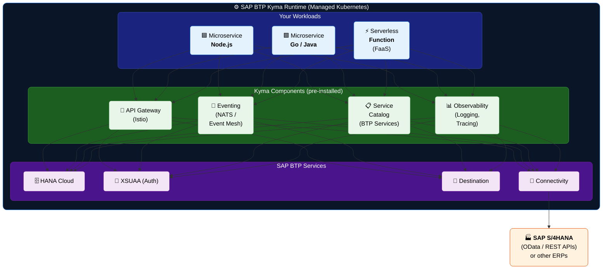

# SAP BTP Kyma Runtime — Architecture

```mermaid
graph TB
    subgraph KYMA["⚙️ SAP BTP Kyma Runtime (Managed Kubernetes)"]
        direction TB

        subgraph Workloads["Your Workloads"]
            direction LR
            MS1["🟦 Microservice<br/><b>Node.js</b>"]
            MS2["🟩 Microservice<br/><b>Go / Java</b>"]
            FN["⚡ Serverless<br/><b>Function</b><br/>(FaaS)"]
        end

        subgraph Components["Kyma Components (pre-installed)"]
            direction LR
            GW["🚪 API Gateway<br/>(Istio)"]
            EV["📨 Eventing<br/>(NATS /<br/>Event Mesh)"]
            SC["📋 Service<br/>Catalog<br/>(BTP Services)"]
            OB["📊 Observability<br/>(Logging,<br/>Tracing)"]
        end

        subgraph Services["SAP BTP Services"]
            direction LR
            HANA["🗄️ HANA Cloud"]
            XSUAA["🔐 XSUAA (Auth)"]
            DEST["🔗 Destination"]
            CONN["📡 Connectivity"]
        end
    end

    MS1 & MS2 & FN --> GW & EV & SC & OB
    GW & EV & SC & OB --> HANA & XSUAA & DEST & CONN

    S4["🏭 <b>SAP S/4HANA</b><br/>(OData / REST APIs)<br/>or other ERPs"]

    CONN --> S4

    style KYMA fill:#0a1628,stroke:#1a73e8,color:#fff,rx:10
    style Workloads fill:#1a237e,stroke:#3949ab,color:#fff,rx:8
    style Components fill:#1b5e20,stroke:#388e3c,color:#fff,rx:8
    style Services fill:#4a148c,stroke:#7b1fa2,color:#fff,rx:8
    style MS1 fill:#e3f2fd,stroke:#1565c0,color:#000,rx:6
    style MS2 fill:#e3f2fd,stroke:#1565c0,color:#000,rx:6
    style FN fill:#e3f2fd,stroke:#1565c0,color:#000,rx:6
    style GW fill:#e8f5e9,stroke:#2e7d32,color:#000,rx:6
    style EV fill:#e8f5e9,stroke:#2e7d32,color:#000,rx:6
    style SC fill:#e8f5e9,stroke:#2e7d32,color:#000,rx:6
    style OB fill:#e8f5e9,stroke:#2e7d32,color:#000,rx:6
    style HANA fill:#f3e5f5,stroke:#6a1b9a,color:#000,rx:6
    style XSUAA fill:#f3e5f5,stroke:#6a1b9a,color:#000,rx:6
    style DEST fill:#f3e5f5,stroke:#6a1b9a,color:#000,rx:6
    style CONN fill:#f3e5f5,stroke:#6a1b9a,color:#000,rx:6
    style S4 fill:#fff3e0,stroke:#e65100,color:#000,rx:8
```