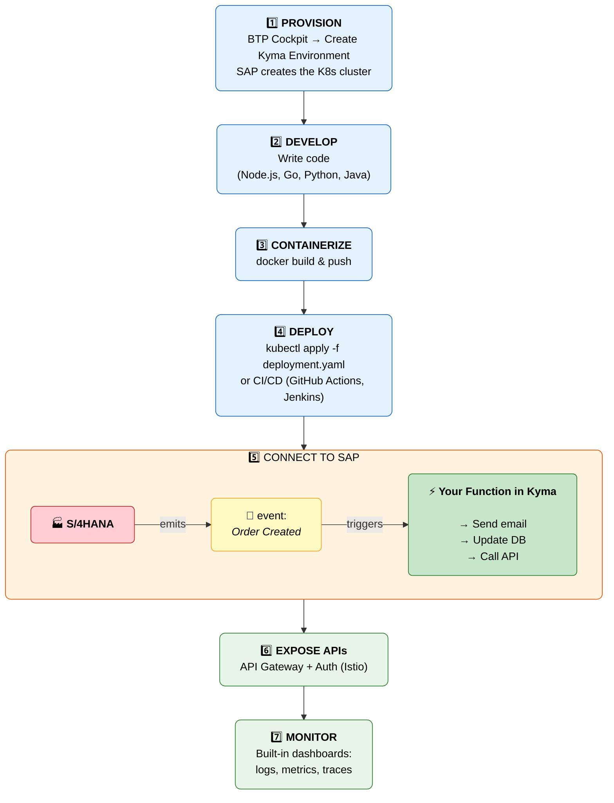

# SAP BTP Kyma Runtime — Practical Flow

```mermaid
graph TD
    P1["1️⃣ <b>PROVISION</b><br/>BTP Cockpit → Create Kyma Environment<br/>SAP creates the K8s cluster"]
    P2["2️⃣ <b>DEVELOP</b><br/>Write code<br/>(Node.js, Go, Python, Java)"]
    P3["3️⃣ <b>CONTAINERIZE</b><br/>docker build & push"]
    P4["4️⃣ <b>DEPLOY</b><br/>kubectl apply -f deployment.yaml<br/>or CI/CD (GitHub Actions, Jenkins)"]

    P1 --> P2 --> P3 --> P4

    P4 --> P5

    subgraph P5["5️⃣ CONNECT TO SAP"]
        direction LR
        S4["🏭 <b>S/4HANA</b>"]
        EVT["📨 event:<br/><i>Order Created</i>"]
        FN["⚡ <b>Your Function in Kyma</b><br/><br/>→ Send email<br/>→ Update DB<br/>→ Call API"]
        S4 -->|emits| EVT -->|triggers| FN
    end

    P5 --> P6["6️⃣ <b>EXPOSE APIs</b><br/>API Gateway + Auth (Istio)"]
    P6 --> P7["7️⃣ <b>MONITOR</b><br/>Built-in dashboards:<br/>logs, metrics, traces"]

    style P1 fill:#e3f2fd,stroke:#1565c0,color:#000,rx:8
    style P2 fill:#e3f2fd,stroke:#1565c0,color:#000,rx:8
    style P3 fill:#e3f2fd,stroke:#1565c0,color:#000,rx:8
    style P4 fill:#e3f2fd,stroke:#1565c0,color:#000,rx:8
    style P5 fill:#fff3e0,stroke:#e65100,color:#000,rx:8
    style P6 fill:#e8f5e9,stroke:#2e7d32,color:#000,rx:8
    style P7 fill:#e8f5e9,stroke:#2e7d32,color:#000,rx:8
    style S4 fill:#ffcdd2,stroke:#c62828,color:#000,rx:6
    style EVT fill:#fff9c4,stroke:#f9a825,color:#000,rx:6
    style FN fill:#c8e6c9,stroke:#2e7d32,color:#000,rx:6
```