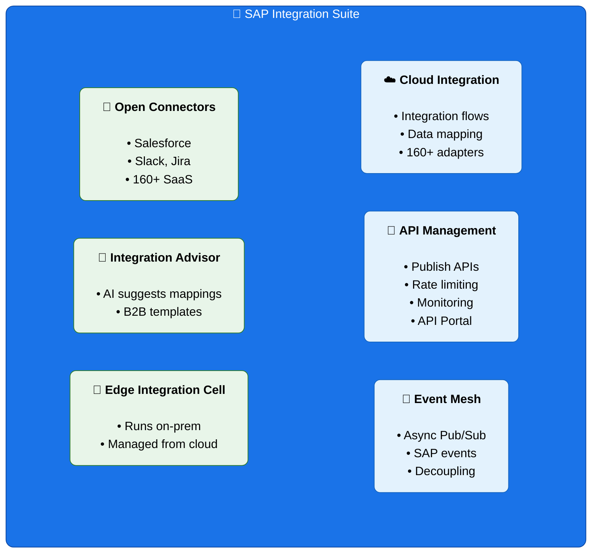

# SAP Integration Suite — Components

```mermaid
graph TB
    subgraph IS["🔗 SAP Integration Suite"]
        direction TB

        subgraph Row1[" "]
            direction LR
            CI["☁️ <b>Cloud Integration</b><br/><br/>• Integration flows<br/>• Data mapping<br/>• 160+ adapters"]
            API["🔌 <b>API Management</b><br/><br/>• Publish APIs<br/>• Rate limiting<br/>• Monitoring<br/>• API Portal"]
            EM["📨 <b>Event Mesh</b><br/><br/>• Async Pub/Sub<br/>• SAP events<br/>• Decoupling"]
        end

        subgraph Row2[" "]
            direction LR
            OC["🔗 <b>Open Connectors</b><br/><br/>• Salesforce<br/>• Slack, Jira<br/>• 160+ SaaS"]
            IA["🤖 <b>Integration Advisor</b><br/><br/>• AI suggests mappings<br/>• B2B templates"]
            EIC["🏢 <b>Edge Integration Cell</b><br/><br/>• Runs on-prem<br/>• Managed from cloud"]
        end
    end

    style IS fill:#1a73e8,stroke:#0d47a1,color:#fff,rx:10
    style Row1 fill:none,stroke:none
    style Row2 fill:none,stroke:none
    style CI fill:#e3f2fd,stroke:#1565c0,color:#000,rx:8
    style API fill:#e3f2fd,stroke:#1565c0,color:#000,rx:8
    style EM fill:#e3f2fd,stroke:#1565c0,color:#000,rx:8
    style OC fill:#e8f5e9,stroke:#2e7d32,color:#000,rx:8
    style IA fill:#e8f5e9,stroke:#2e7d32,color:#000,rx:8
    style EIC fill:#e8f5e9,stroke:#2e7d32,color:#000,rx:8
```