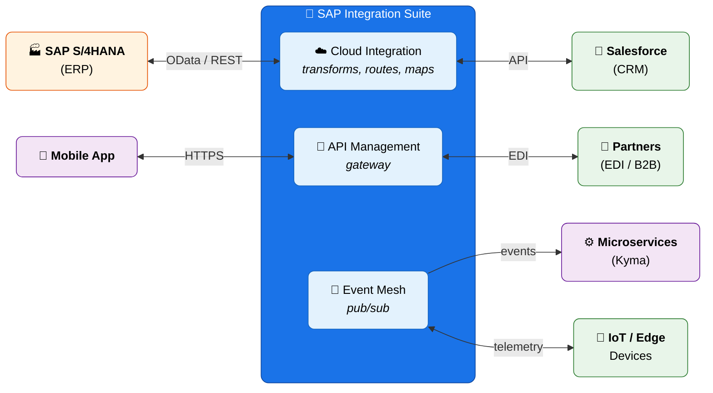

# SAP Integration Suite — Integration Flow

```mermaid
graph LR
    ERP["🏭 <b>SAP S/4HANA</b><br/>(ERP)"]
    MOB["📱 <b>Mobile App</b>"]
    KYMA["⚙️ <b>Microservices</b><br/>(Kyma)"]

    subgraph IS["🔗 SAP Integration Suite"]
        direction TB
        CInt["☁️ Cloud Integration<br/><i>transforms, routes, maps</i>"]
        APIMgmt["🔌 API Management<br/><i>gateway</i>"]
        EvMesh["📨 Event Mesh<br/><i>pub/sub</i>"]
    end

    SF["💼 <b>Salesforce</b><br/>(CRM)"]
    PART["🤝 <b>Partners</b><br/>(EDI / B2B)"]
    IOT["📡 <b>IoT / Edge</b><br/>Devices"]

    ERP <-->|OData / REST| CInt
    CInt <-->|API| SF

    MOB <-->|HTTPS| APIMgmt
    APIMgmt <-->|EDI| PART

    EvMesh -->|events| KYMA
    EvMesh <-->|telemetry| IOT

    style IS fill:#1a73e8,stroke:#0d47a1,color:#fff,rx:10
    style CInt fill:#e3f2fd,stroke:#1565c0,color:#000,rx:8
    style APIMgmt fill:#e3f2fd,stroke:#1565c0,color:#000,rx:8
    style EvMesh fill:#e3f2fd,stroke:#1565c0,color:#000,rx:8
    style ERP fill:#fff3e0,stroke:#e65100,color:#000,rx:8
    style MOB fill:#f3e5f5,stroke:#6a1b9a,color:#000,rx:8
    style KYMA fill:#f3e5f5,stroke:#6a1b9a,color:#000,rx:8
    style SF fill:#e8f5e9,stroke:#2e7d32,color:#000,rx:8
    style PART fill:#e8f5e9,stroke:#2e7d32,color:#000,rx:8
    style IOT fill:#e8f5e9,stroke:#2e7d32,color:#000,rx:8
```