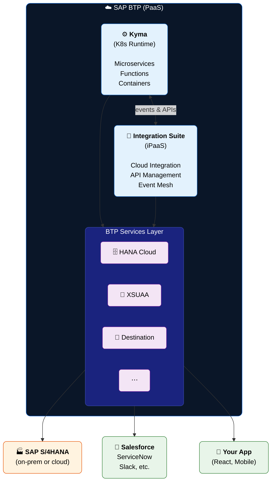

# How Everything Fits Together — Big Picture

```mermaid
graph TB
    subgraph BTP["☁️ SAP BTP (PaaS)"]
        direction TB

        subgraph Runtimes[" "]
            direction LR
            KYMA["⚙️ <b>Kyma</b><br/>(K8s Runtime)<br/><br/>Microservices<br/>Functions<br/>Containers"]
            IS["🔗 <b>Integration Suite</b><br/>(iPaaS)<br/><br/>Cloud Integration<br/>API Management<br/>Event Mesh"]
        end

        KYMA <-->|events & APIs| IS

        subgraph SvcLayer["BTP Services Layer"]
            direction LR
            HANA["🗄️ HANA Cloud"]
            AUTH["🔐 XSUAA"]
            DEST["🔗 Destination"]
            MORE["⋯"]
        end

        KYMA & IS --> SvcLayer
    end

    S4["🏭 <b>SAP S/4HANA</b><br/>(on-prem or cloud)"]
    EXT["💼 <b>Salesforce</b><br/>ServiceNow<br/>Slack, etc."]
    APP["📱 <b>Your App</b><br/>(React, Mobile)"]

    SvcLayer --> S4
    SvcLayer --> EXT
    SvcLayer --> APP

    style BTP fill:#0a1628,stroke:#1a73e8,color:#fff,rx:10
    style Runtimes fill:none,stroke:none
    style SvcLayer fill:#1a237e,stroke:#3949ab,color:#fff,rx:8
    style KYMA fill:#e3f2fd,stroke:#1565c0,color:#000,rx:8
    style IS fill:#e3f2fd,stroke:#1565c0,color:#000,rx:8
    style HANA fill:#f3e5f5,stroke:#6a1b9a,color:#000,rx:6
    style AUTH fill:#f3e5f5,stroke:#6a1b9a,color:#000,rx:6
    style DEST fill:#f3e5f5,stroke:#6a1b9a,color:#000,rx:6
    style MORE fill:#f3e5f5,stroke:#6a1b9a,color:#000,rx:6
    style S4 fill:#fff3e0,stroke:#e65100,color:#000,rx:8
    style EXT fill:#e8f5e9,stroke:#2e7d32,color:#000,rx:8
    style APP fill:#e8f5e9,stroke:#2e7d32,color:#000,rx:8
```