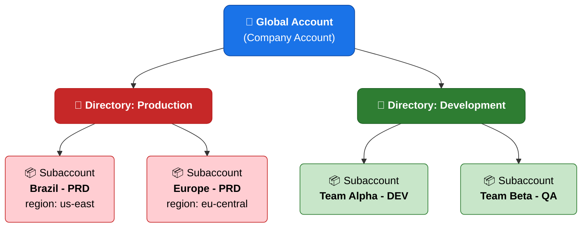
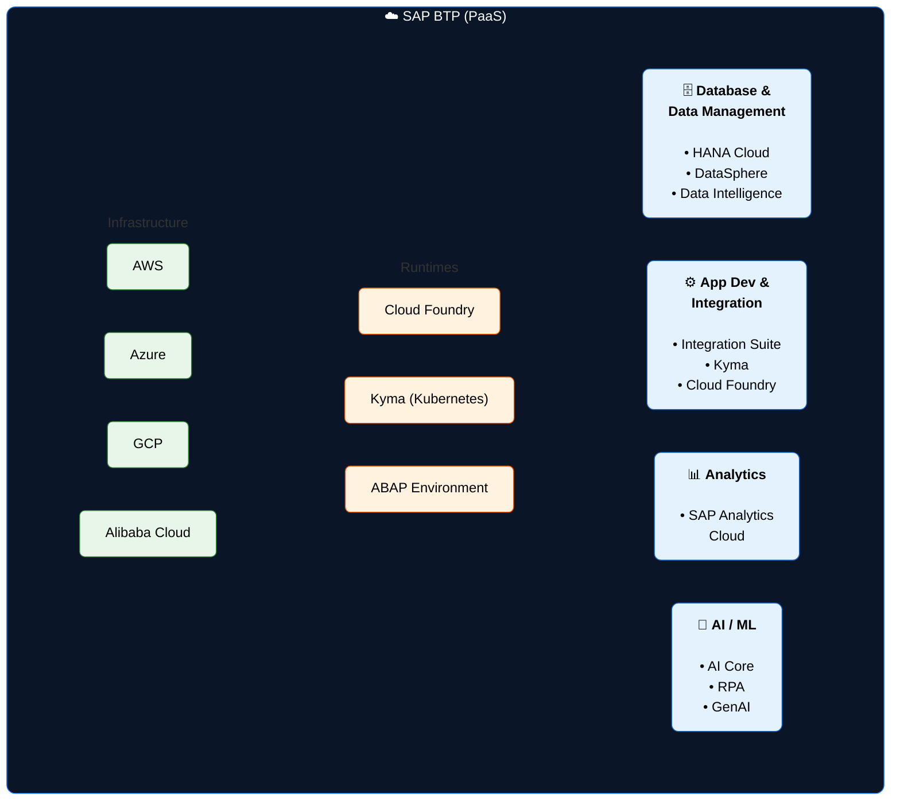
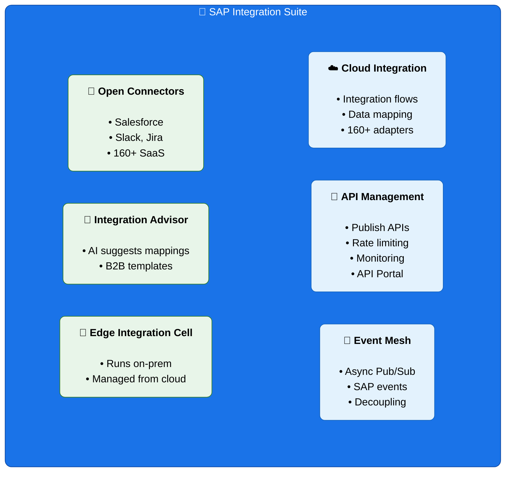
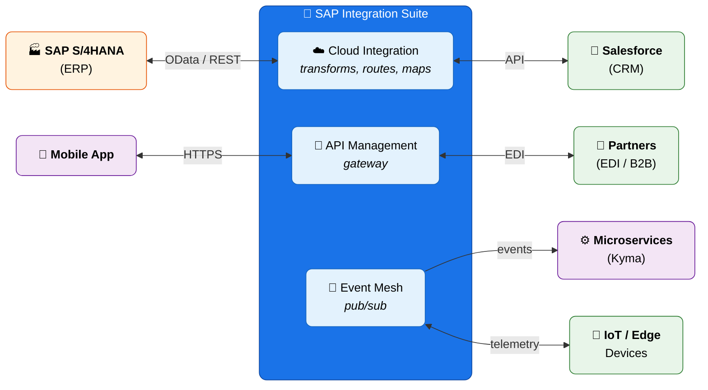
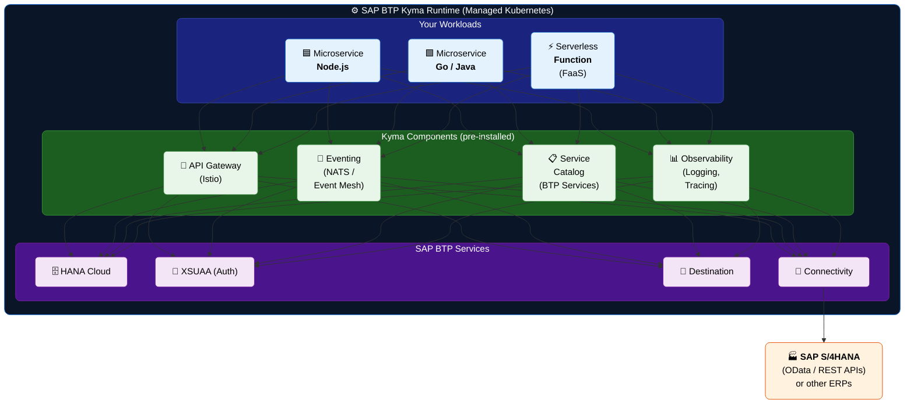
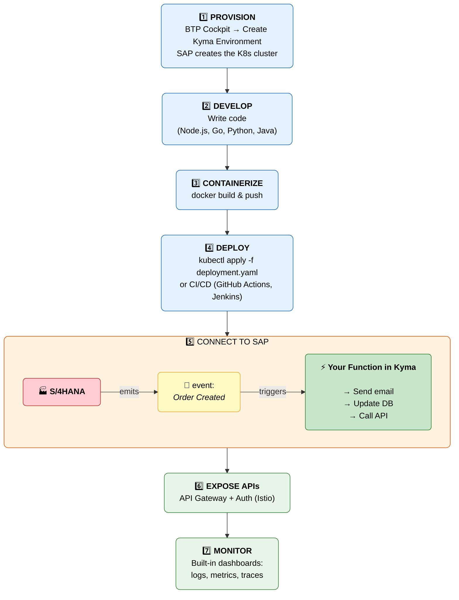
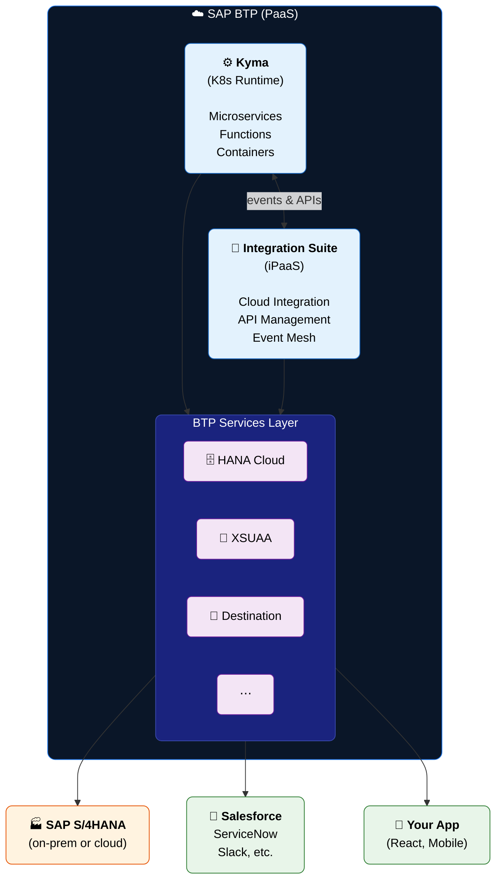

# 🧭 SAP BTP, Integration Suite & Kyma
## Guia para Desenvolvedores Non-SAP

---

# 📑 Agenda

1. O que é SAP BTP?
2. Estrutura Organizacional do BTP
3. Pilares do BTP
4. SAP Integration Suite — Componentes
5. SAP Integration Suite — Fluxo de Integração
6. SAP BTP Kyma Runtime — Arquitetura
7. SAP BTP Kyma Runtime — Fluxo Prático
8. Kyma vs Cloud Foundry
9. Como Tudo se Conecta — Big Picture
10. Resumo & Referências

---

# 1. O que é SAP BTP?

**SAP BTP (Business Technology Platform)** é o **PaaS (Platform as a Service)** da SAP — pense nele como o **"AWS/Azure/GCP" da SAP**.

Ele reúne tudo o que você precisa para **desenvolver, integrar, automatizar e analisar dados** no ecossistema SAP (e fora dele também).

### 🔑 Analogia

> Se o **SAP S/4HANA** (ERP) fosse um **prédio comercial**, o **SAP BTP** seria o **terreno + infraestrutura** (estradas, energia, água, internet) ao redor dele, permitindo construir **anexos, estacionamentos e lojas** sem tocar no prédio principal.

### 🧹 Conceito-Chave: "Clean Core"

A SAP incentiva a **NÃO modificar o ERP diretamente**. Em vez disso, use o BTP para criar **extensões side-by-side**:

| Abordagem | Analogia |
|-----------|----------|
| ❌ Modificar o ERP | Fazer **fork** de uma library e manter manualmente |
| ✅ Extensão via BTP | Criar um **plugin/extensão** que consome a API da library |

---

# 2. Estrutura Organizacional do BTP



### Equivalência com o Mundo Non-SAP

| SAP BTP | Equivalente AWS |
|---------|-----------------|
| **Global Account** | AWS Organization |
| **Directory** | OU (Organizational Unit) |
| **Subaccount** | AWS Account individual |

---

# 3. Pilares do SAP BTP



### 4 Pilares

| Pilar | O que faz | Destaques |
|-------|-----------|-----------|
| 🗄️ **Database & Data Mgmt** | Armazenamento e gestão de dados | HANA Cloud, DataSphere, Data Intelligence |
| ⚙️ **App Dev & Integration** | Desenvolvimento e integração de apps | Integration Suite, Kyma, Cloud Foundry |
| 📊 **Analytics** | Análise de dados e BI | SAP Analytics Cloud |
| 🤖 **AI / ML** | Inteligência artificial e automação | AI Core, RPA, GenAI |

---

# 4. SAP Integration Suite — Componentes

### 🔑 Analogia

> Se seus sistemas fossem **ilhas**, a Integration Suite seria a **rede de pontes, balsas e cabos submarinos** conectando todos eles.

É o **iPaaS (Integration Platform as a Service)** da SAP — equivalente a **Apache Kafka + MuleSoft + Kong API Gateway** — tudo em um.



### Mapeamento para o Mundo Non-SAP

| SAP Integration Suite | Equivalente Non-SAP |
|-----------------------|---------------------|
| Cloud Integration | Apache Camel / MuleSoft / n8n |
| API Management | Kong / Apigee / AWS API Gateway |
| Event Mesh | Apache Kafka / RabbitMQ / AWS SNS+SQS |
| Open Connectors | Zapier / Workato (conectores prontos) |
| Integration Advisor | IA que sugere mapeamentos de dados |
| Edge Integration Cell | Agente on-prem gerenciado (tipo Azure Arc) |

---

# 5. SAP Integration Suite — Fluxo de Integração



### Como funciona:

| Componente | Papel no Fluxo | Protocolo |
|------------|----------------|-----------|
| **Cloud Integration** | Transforma, roteia e mapeia dados entre SAP e Salesforce | OData / REST / API |
| **API Management** | Gateway para apps mobile e parceiros B2B | HTTPS / EDI |
| **Event Mesh** | Pub/Sub assíncrono para microserviços e IoT | Eventos / Telemetria |

---

# 6. SAP BTP Kyma Runtime — Arquitetura

### 🔑 Analogia

> Se **Kubernetes** fosse um **terreno vazio com infraestrutura**, **Kyma** seria um **parque industrial pronto** — já tem portaria (API Gateway), sistema de alarme (observabilidade), correio (eventing) e conexão direta com a "fábrica SAP" ao lado.

**Kyma = Kubernetes gerenciado pela SAP**, equivalente ao **EKS/AKS/GKE**, mas com "baterias incluídas" para o ecossistema SAP.



### Camadas da Arquitetura

| Camada | Componentes | Função |
|--------|-------------|--------|
| **Your Workloads** | Microservices (Node.js, Go, Java), Serverless Functions | Seu código de negócio |
| **Kyma Components** | API Gateway (Istio), Eventing (NATS), Service Catalog, Observability | Infraestrutura pré-instalada |
| **BTP Services** | HANA Cloud, XSUAA, Destination, Connectivity | Serviços gerenciados da plataforma |
| **SAP S/4HANA** | OData / REST APIs | ERP e sistemas backend |

---

# 7. SAP BTP Kyma Runtime — Fluxo Prático



### Passo a Passo Detalhado

| Etapa | Ação | Ferramenta / Comando |
|-------|------|----------------------|
| 1️⃣ **Provision** | Criar ambiente Kyma | BTP Cockpit |
| 2️⃣ **Develop** | Escrever código em qualquer linguagem | VS Code, IntelliJ, etc. |
| 3️⃣ **Containerize** | Empacotar em containers Docker | `docker build` / `docker push` |
| 4️⃣ **Deploy** | Aplicar no cluster K8s | `kubectl apply -f` / CI/CD |
| 5️⃣ **Connect** | Receber eventos do SAP automaticamente | Kyma Eventing |
| 6️⃣ **Expose** | Expor APIs com autenticação | API Gateway (Istio) |
| 7️⃣ **Monitor** | Dashboards de logs, métricas e traces | Observability nativa |

---

# 8. Kyma vs Cloud Foundry

Os dois **runtimes** do SAP BTP lado a lado:

| Característica | ⚙️ Kyma | ☁️ Cloud Foundry |
|---------------|---------|-------------------|
| **Base** | Kubernetes | Cloud Foundry (PaaS) |
| **Controle** | Total (YAML, Helm, kubectl) | Abstraído (`cf push`) |
| **Curva de aprendizado** | Mais íngreme (requer K8s) | Mais suave (mais opinativo) |
| **Flexibilidade** | Muito alta | Média |
| **Ideal para** | Microservices, event-driven | Apps tradicionais, APIs |
| **Analogia** | EKS / AKS / GKE | Heroku / Railway |

### Quando usar qual?

```text
Kyma  → Você quer controle total, já conhece Kubernetes,
         precisa de event-driven architecture ou microservices complexos.

Cloud Foundry → Você quer simplicidade, deploy rápido com `cf push`,
                 ideal para apps tradicionais e APIs REST simples.
```

---

# 9. Como Tudo se Conecta — Big Picture



### Resumo da Conexão

| De | Para | Via |
|----|------|-----|
| **Kyma** (microservices) | **Integration Suite** | Eventos & APIs |
| **Integration Suite** | **SAP S/4HANA** | OData / REST / RFC |
| **Integration Suite** | **Salesforce, Slack, etc.** | Open Connectors / APIs |
| **BTP Services** | **Todos os componentes** | Service Catalog / Bindings |

---

# 10. Resumo em Uma Linha

| Componente | Uma frase |
|------------|-----------|
| **SAP BTP** | PaaS multi-cloud da SAP — o "terreno" onde se constrói, integra e analisa tudo. |
| **Integration Suite** | iPaaS que conecta SAP e non-SAP via APIs, eventos e flows — o "correio + pontes" entre sistemas. |
| **Kyma** | Kubernetes gerenciado com "baterias SAP" — onde se roda microservices e funções serverless. |

---

# 🔗 Referências Úteis

| Recurso | Link |
|---------|------|
| SAP BTP Overview 2025 | [PDF Oficial](https://assets.dm.ux.sap.com/sap-user-groups/pdfs/250218_sap_business_technoloy_platform_2025_overview.pdf) |
| SAP BTP Explained | [developers.dev](https://www.developers.dev/tech-talk/sap-btp-explained-the-backbone-of-a-modern-enterprise.html) |
| Guia Completo SAP BTP | [sapa2z.com](https://sapa2z.com/comprehensive-guide-to-sap-btp/) |
| Arquitetura SAP BTP | [kaartech.com](https://www.kaartech.com/blogs/sap-btp-architecture/) |
| SAP Integration Suite | [sap.com](https://www.sap.com/products/integration-suite.html) |
| Help Portal | [help.sap.com](https://help.sap.com/docs/integration-suite) |

---

> *Apresentação gerada a partir do guia SAP BTP, Integration Suite & Kyma para desenvolvedores non-SAP.*
