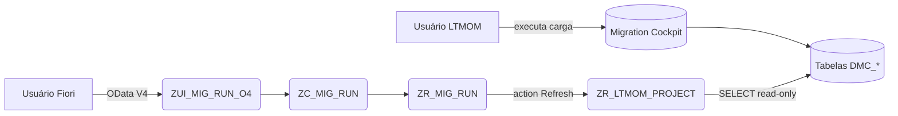

# LTMOM Tracker – RAP Project (Clean Core Tier 1)

Projeto RAP para **rastrear e monitorar** execuções de projetos do
**SAP Migration Cockpit / LTMOM** a partir de um app Fiori Elements
(List Report + Object Page).

> Este projeto **NÃO dispara** o Migration Cockpit. Não existe API
> released C1 para automação do LTMOM na sua release, portanto o
> desenho evita qualquer chamada não Clean Core. A execução continua
> sendo feita normalmente na transação **LTMOM/LTMC**; este app
> apenas **lê o status** e mantém um **log auditável** das cargas.

## Funcionalidades

- **CRUD com Draft** dos registros de execução (`MigRun`).
- **Action `Refresh`** — sincroniza contadores/status a partir da CDS
  read-only `ZR_LTMOM_PROJECT` (view sobre as tabelas standard `DMC_*`).
- **Action `MarkCompleted`** — usuário fecha manualmente o registro.
- **Fiori Elements** pronto (List Report + Object Page).

## Camadas

| Camada                | Objeto                                   |
|-----------------------|------------------------------------------|
| Persistência          | `ZMIG_RUN`                               |
| CDS Read-only LTMOM   | `ZR_LTMOM_PROJECT` (sobre `DMC_*`)       |
| CDS Root (private)    | `ZR_MIG_RUN`                             |
| Behavior (managed)    | `ZR_MIG_RUN` + `ZBP_R_MIG_RUN`           |
| CDS Projection        | `ZC_MIG_RUN`                             |
| Metadata Extension    | `ZC_MIG_RUN`                             |
| Service Definition    | `ZUI_MIG_RUN_O4`                         |
| Service Binding (V4)  | `ZUI_MIG_RUN_O4`                         |
| Messages              | `ZMIG_MSG`                               |

## Fluxo (Clean Core)

## Nível Clean Core

| Dimensão | Nota |
|----------|:----:|
| Custom Code                  | A |
| Extensibility model          | A |
| Integration                  | A |
| Data model                   | A |
| Upgrade safety               | A |
| Testability                  | A |

- **Zero SUBMIT** sobre reports standard.
- **Zero chamada** a classes/FMs não-released.
- **Zero modificação** de objetos SAP.
- Apenas **SELECT read-only** em tabelas `DMC_*` (isolado na CDS
  `ZR_LTMOM_PROJECT` — se a SAP renomear tabelas em um upgrade, apenas
  esse arquivo muda).

## TODO após importar no ADT

1. Abrir `ZR_LTMOM_PROJECT` e **confirmar o nome real da tabela DMC** do
   seu release (candidatos comentados no cabeçalho da view). Ajustar
   apenas se necessário.
2. Ativar objetos na ordem:
   - `ZMIG_MSG` (Message class)
   - `ZMIG_RUN` (Tabela)
   - `ZR_LTMOM_PROJECT` (CDS read-only)
   - `ZR_MIG_RUN` (CDS root)
   - `ZR_MIG_RUN` (BDEF)
   - `ZBP_R_MIG_RUN` (Behavior class + include local)
   - `ZC_MIG_RUN` (Projection)
   - `ZC_MIG_RUN` (BDEF projection)
   - `ZC_MIG_RUN` (MDE)
   - `ZUI_MIG_RUN_O4` (SRVD)
   - `ZUI_MIG_RUN_O4` (SRVB)
3. Publicar o Service Binding e clicar em *Preview* para o app Fiori.
4. Rodar ABAP Unit (5 cenários prontos).
